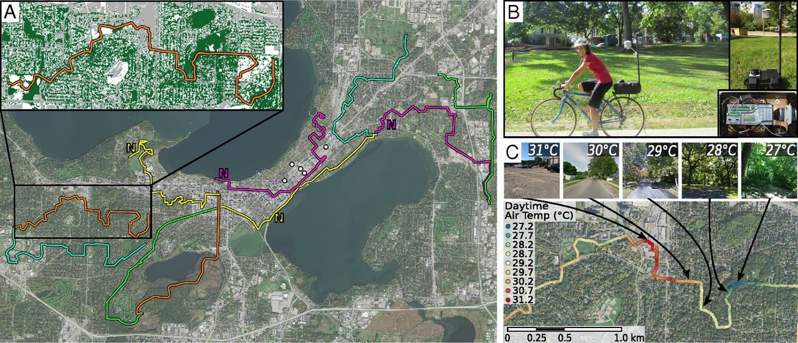
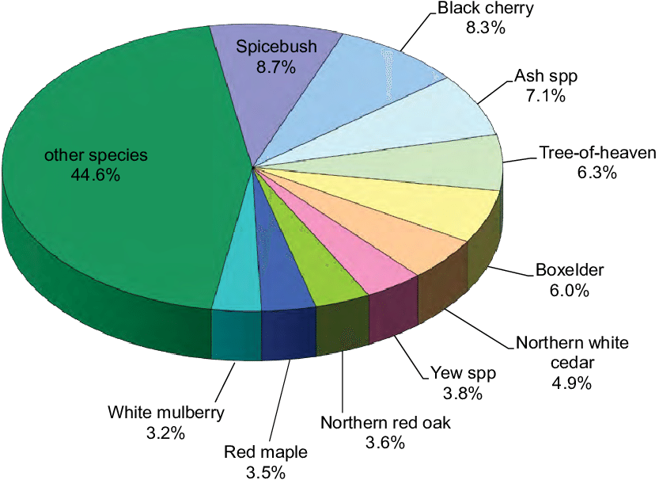

# Introduction to the question

Urban tree coverage must change over time, however it seems removal without placement is a more common trend of tree management by many property owners. The albedo of tree leaves is higher than asphalt, and shade provided alters the heat landscapes of neighborhoods.

# Directing Question

What kind of changes could planting trees on currently vacant sites bring to the City of Buffalo?

# Inspiring Examples

## Example 1

This set of graphics inspires me to display the tree occurrence data across the City of Buffalo. A method of creating a map from this is inputting the location data using Leaflet.

## Example 2

This could be useful in creating a breakdown of tree species occurrence and counts. It allows for grouping and size options for multiple variables.

## Example 3

# Proposed data sources

[<i class="fa fa-file-code-o fa-1x" aria-hidden="true"></i> Open data for the City of Buffalo's Tree Inventory](https://data.buffalony.gov/Quality-of-Life/Tree-Inventory/n4ni-uuec/data)

# Proposed methods

The packages used will include leaflet for map display of the coordinate point data. Ggplot and ggraph to display data and counts according to the dataset.

# Expected results

A detailed analysis of potential tree cover and projected cost savings. Should vacant spaces have trees? What criteria would fit best for each tree site?
